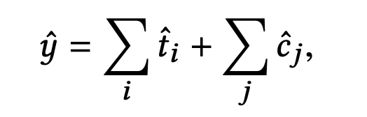
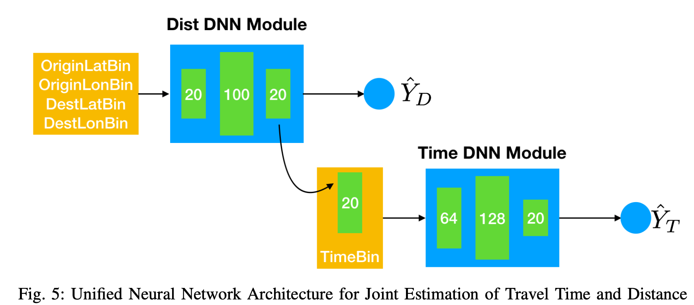

## Different Approach

### the route-based solution

> the overall travel time of a given route is formulated as the summation of the travel time through each road segment1 and the delay time at each intersection

#### Segment-based method 

> estimate the travel time on individual road segments first and then take the sum over all the road segments of the query route as the travel time estimation. 

Segment-based method does not consider the transition time between road segments such as waiting for traffic lights and making left/right turns.

#### Path-based method

> considering the time spent on intersections

**Road Network**
> A road network *RN* is comprised of a set of road segments *{ r }* connected among each other in a graph format.

**Road segment**: 

> Road segment *r* is a directed edge with two terminal points

**Trajectory**: 

> A spatial trajectory *Tr* is a sequence of time-ordered points, *Tr: p1 -> p2 -> ... -> pn* , where each point has a geospatial coordinate set and a timestamp, *p = (x, y, t)*.

**Path**: 
> A path *P* is represented by a sequence of connected road segments, e.g., *P: r1 -> r2 -> ... -> rn*, in an *RN*.

### A Unified Neural Network Approach for Estimating Travel Time and Distance for a Taxi Trip(2017) ###

We propose a model, called ST-NN (Spatio-Temporal Neural Network), which first predicts the travel distance between an origin and a destination GPS coordinate, then combines this prediction with the time of day to predict the travel time.

### A Simple Baseline for Travel Time Estimation using Large-Scale Trip Data(2015)

To the best of our knowledge, we are **the first** to directly work on such origin-destination (OD) travel time queries

We call our method as *neighbor-based method*. The biggest benefit of our approach is its simplicity.

### Travel time prediction with LSTM neural network(2016)

