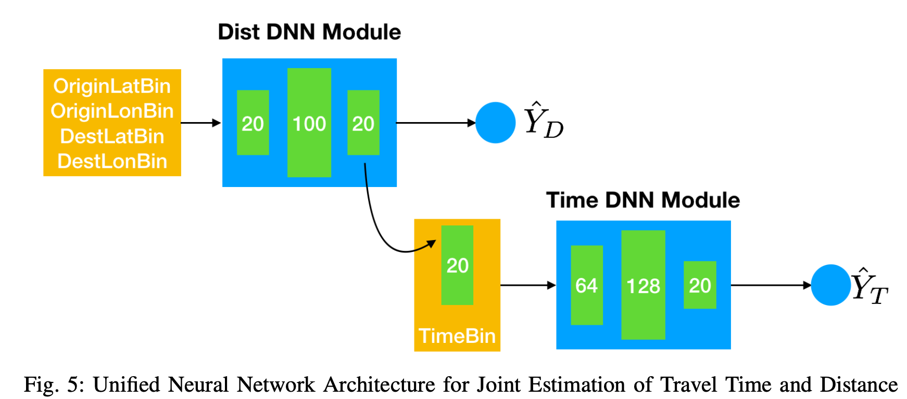

## Different Approach

### The route-based solution

> the overall travel time of a given route is formulated as the summation of the travel time through each road segment1 and the delay time at each intersection

* #### Segment-based method 

> estimate the travel time on individual road segments first and then take the sum over all the road segments of the query route as the travel time estimation. 

> Segment-based method does not consider the transition time between road segments such as waiting for traffic lights and making left/right turns.

[1]C. de Fabritiis, R. Ragona, and G. Valenti, “Traffic Estimation And Prediction Based On Real Time Floating Car Data,” in 2008 11th International IEEE Conference on Intelligent Transportation Systems, Beijing, China, 2008, pp. 197–203, doi: 10.1109/ITSC.2008.4732534.

（基于60万意大利私家车实时GPS数据，每三分钟估计一次道路速度）

* #### Path-based method

> considering the time spent on intersections

### The data-driven solution

> do not predict the traffic speed and travel time on each road segment

> directly predict the travel time of the whole route at a future time period based on its historical travel time

* #### 转化为时间序列问题 ####

> D. Billings and J.-S. Yang, “Application of the ARIMA Models to Urban Roadway Travel Time Prediction - A Case Study,” in 2006 IEEE International Conference on Systems, Man and Cybernetics, 2006, vol. 3, pp. 2529–2534, doi: 10.1109/ICSMC.2006.385244.

> Y. Duan, Y. L.V., and F.-Y. Wang, “Travel time prediction with LSTM neural network,” in 2016 IEEE 19th International Conference on Intelligent Transportation Systems (ITSC), Rio de Janeiro, 2016, pp. 1053–1058, doi: 10.1109/ITSC.2016.7795686.

Drawback: The travel time prediction is restricted to several fixed routes. It is difficult to be generalized into the un- seen routes, which limits the scalability of the problem

* #### estimate the travel time of a queried route using a weighted average of its neighboring trips, which refer to the trips with similar origin and destination locations. 
H. Wang, Z. Li, Y.-H. Kuo, and D. Kifer, “A Simple Baseline for Travel Time Estimation using Large-Scale Trip Data,” arXiv:1512.08580 [cs], Dec. 2015.

(自称计算的为origin-destination (OD) travel time)

Drawback: The insufficient data coverage problem still exists. It is difficult to obtain the travel time at all historical time periods for the queried route or even a similar route

## Definition

**Road Network**
> A road network *RN* is comprised of a set of road segments *{ r }* connected among each other in a graph format.

**Road segment**: 

> Road segment *r* is a directed edge with two terminal points

**Trajectory**: 

> A spatial trajectory *Tr* is a sequence of time-ordered points, *Tr: p1 -> p2 -> ... -> pn* , where each point has a geospatial coordinate set and a timestamp, *p = (x, y, t)*.

**Path**: 
> A path *P* is represented by a sequence of connected road segments, e.g., *P: r1 -> r2 -> ... -> rn*, in an *RN*.

## Papers

### A Simple Baseline for Travel Time Estimation using Large-Scale Trip Data(2015)

To the best of our knowledge, we are **the first** to directly work on such origin-destination (OD) travel time queries

We call our method as *neighbor-based method*. The biggest benefit of our approach is its simplicity.

### Travel time prediction with LSTM neural network(2016)

### A Unified Neural Network Approach for Estimating Travel Time and Distance for a Taxi Trip(2017) ###

We propose a model, called ST-NN (Spatio-Temporal Neural Network), which first predicts the travel distance between an origin and a destination GPS coordinate, then combines this prediction with the time of day to predict the travel time.

